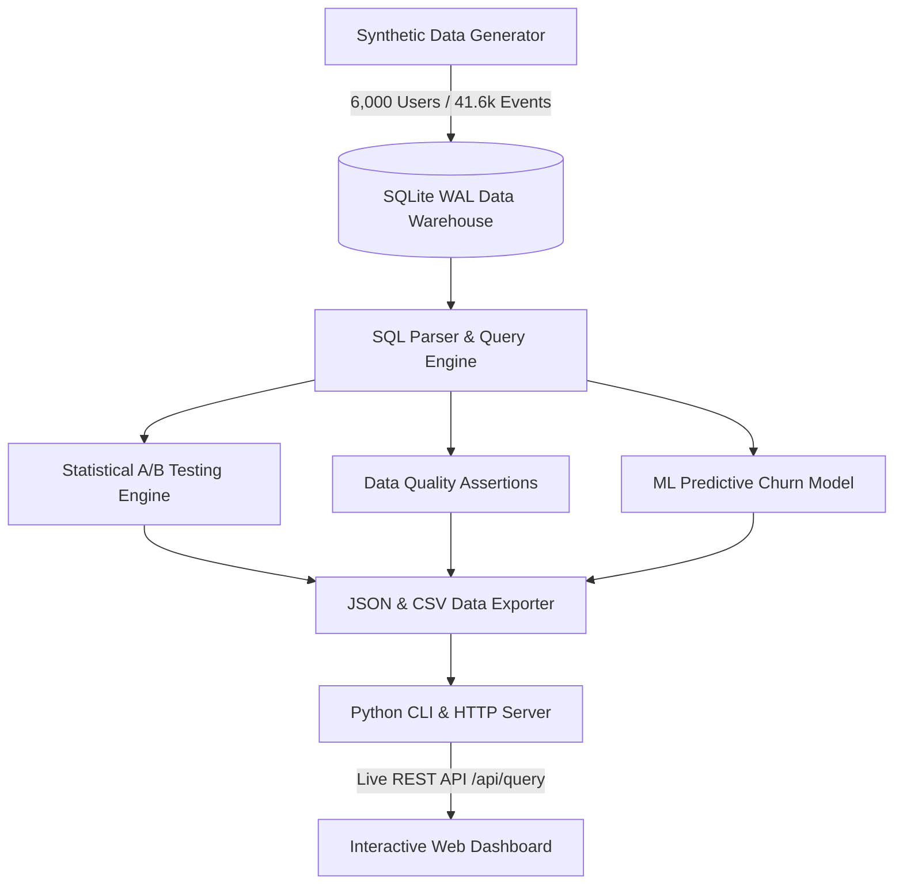

<div align="center">

  # ⚡ PixelPulse AI
  ### Enterprise Product Analytics & Live SQL Data Warehouse Platform

  [](https://python.org)
  [](https://sqlite.org)
  [](https://pytest.org)
  [](LICENSE)

  <p align="center">
    <b>A high-performance product analytics data warehouse and interactive executive dashboard.</b><br/>
    Modeling 6,000 user signup cohorts, 41,600+ event streams, A/B testing statistical significance engines, data quality integrity suites, and machine learning predictive churn risk scoring.
  </p>

</div>

---

## 📋 Table of Contents
- [Architecture Overview](#-architecture-overview)
- [Key Features](#-key-features)
- [Analytical Executive Insights](#-analytical-executive-insights)
- [Data Quality Assurance Suite](#-data-quality-assurance-suite)
- [Machine Learning Churn Engine](#-machine-learning-churn-engine)
- [Quickstart Guide](#-quickstart-guide)
- [Project Directory Structure](#-project-directory-structure)
- [Author & License](#-author--license)

---

## 🏗️ Architecture Overview



---

## 🌟 Key Features

* **⚡ Real-Time SQLite Data Warehouse**: High-throughput database in Write-Ahead Logging (WAL) mode with indexed lookups (`idx_users_signup`, `idx_events_user_event`, `idx_users_channel`).
* **📊 5-Stage Acquisition Funnel**: Computes conversion drop-off rates across *Signup $\rightarrow$ Onboarding $\rightarrow$ First Edit $\rightarrow$ Trial $\rightarrow$ Paid Sub*.
* **📈 Cohort Retention Heatmaps**: Tracks monthly user retention curves across 2025 signup cohorts over 3-month evaluation windows.
* **🧪 Statistical A/B Testing Engine**: Evaluates onboarding experiment activation rates using two-proportion $Z$-tests ($Z = 3.894, p = 0.00010$, Cohen's $h = 0.1006$, statistical power $99.8\%$).
* **🤖 Predictive Churn Scoring**: Machine learning behavioral feature extraction model (`src/churn_model.py`) calculating individual user churn probabilities ($0–100\%$).
* **🛡️ Data Quality Suite**: 5 automated assertion rules verifying PK uniqueness, FK referential integrity, mandatory non-null constraints, and temporal consistency.
* **🔍 Live SQL Workbench & `EXPLAIN QUERY PLAN`**: Browser SQL console with real-time SQLite query execution plan inspection and one-click CSV export.

---

## 📊 Analytical Executive Insights

| Metric / Dimension | Strategic Finding | Executive Impact |
| :--- | :--- | :--- |
| **Top Acquisition Channel** | **Referral (16.11% Conv)** | Generates **$4.83 revenue/signup**, outperforming Paid Social ($1.13) by **4.2x**. |
| **Onboarding A/B Test** | **Guided Edit Variant (+4.99 pp Lift)** | $Z = 3.894, p = 0.00010$. Recommended for **100% production rollout**. |
| **Retention Opportunity** | **Day 1–14 Churn Cliff** | Retention plateaus at **32.6% Month 3**. Highest leverage window is Month 0 lifecycle triggers. |
| **ML Predictive Churn** | **58.4% Avg Risk Score** | Identifies un-subscribed users with low event density for targeted re-engagement. |

---

## 🚀 Quickstart Guide

### 1. Clone the Repository
```bash
git clone https://github.com/Yash-Singh607/PixelPulse.git
cd PixelPulse
```

### 2. Install Dependencies
```bash
pip install -r requirements.txt
```

### 3. Run End-to-End Analytics Pipeline
```bash
python cli.py run-all
```

### 4. Launch Interactive Web Dashboard
```bash
python cli.py dashboard
```
Open **`http://localhost:8000`** in your browser.

### 5. Execute PyTest Automated Test Suite
```bash
pytest -v
```

---

## 📂 Project Directory Structure

```text
PixelPulse/
├── cli.py                  # Unified CLI & Backend HTTP REST API server
├── config.py               # Central path configuration & database settings
├── analysis_queries.sql    # Analytical SQL queries (Funnel, Cohort, A/B, Revenue)
├── pixelloft.db            # SQLite Data Warehouse
├── data.json               # Exported analytical payload for web dashboard
│
├── src/
│   ├── data_generator.py   # Synthetic user, event stream, and subscription generator
│   ├── database.py         # SQLite connection pool & query executor
│   ├── sql_parser.py       # SQL file parser & query catalog
│   ├── statistics.py       # A/B test Z-test statistical calculator
│   ├── quality_checks.py   # Data Quality integrity check suite
│   ├── churn_model.py      # ML behavioral churn risk scoring model
│   └── visualization.py    # Chart figure generator
│
├── tests/
│   ├── test_database.py    # Database connection unit tests
│   ├── test_quality.py     # Data quality integrity rule assertions
│   ├── test_statistics.py # A/B test statistical formula tests
│   └── test_churn_model.py # Churn predictor unit tests
│
└── index.html / app.js     # Enterprise Web Dashboard UI & SQL Workbench
```

---

## 👨‍💻 Author & License

**Developed by [Yash Singh](https://github.com/Yash-Singh607)**

Licensed under the **[MIT License](LICENSE)**. Feel free to use, modify, and distribute for portfolio and production projects.
