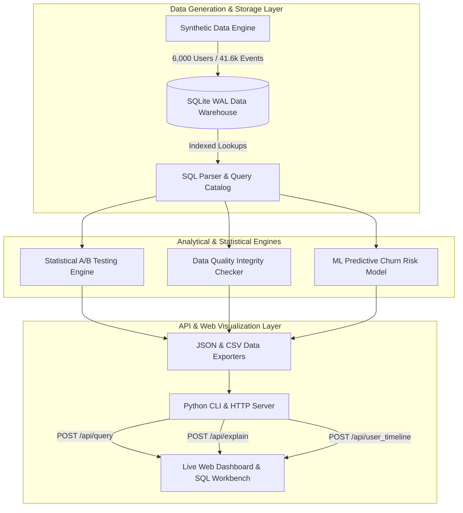

<div align="center">

  # ⚡ PixelPulse AI
  ### Enterprise Product Analytics & Live SQL Data Warehouse Platform

  [](https://pixel-pulse-omega.vercel.app/)
  [](https://python.org)
  [](https://sqlite.org)
  [](https://pytest.org)
  [](https://github.com/Yash-Singh607/PixelPulse)
  [](LICENSE)

  <p align="center">
    <b>A high-performance product analytics data warehouse and real-time executive dashboard.</b><br/>
    Engineered to model 6,000 user signup cohorts, 41,600+ event logs, statistical A/B testing engines, automated data quality suites, and machine learning predictive churn scoring for a freemium SaaS application.
  </p>

  [🚀 Live Production Demo](https://pixel-pulse-omega.vercel.app/) • [Live Local Server](http://localhost:8000) • [Architecture](#-architecture-overview) • [A/B Testing Math](#-statistical-ab-testing-methodology) • [API Spec](#-live-rest-api-specification)

</div>

---

## 📋 Table of Contents
- [Architecture Overview](#-architecture-overview)
- [Key Features](#-key-features)
- [Statistical A/B Testing Methodology](#-statistical-ab-testing-methodology)
- [Machine Learning Churn Scoring Engine](#-machine-learning-churn-scoring-engine)
- [Live REST API Specification](#-live-rest-api-specification)
- [Data Quality Assurance Suite](#-data-quality-assurance-suite)
- [Quickstart Guide](#-quickstart-guide)
- [Directory Structure](#-directory-structure)
- [Author & License](#-author--license)

---

## 🏗️ Architecture Overview



---

## 🌟 Key Features

* **⚡ High-Throughput SQLite Data Warehouse**: Operates in **Write-Ahead Logging (WAL)** mode with indexed B-tree lookups (`idx_users_signup`, `idx_events_user_event`, `idx_users_channel`).
* **📊 5-Stage Acquisition Funnel**: Measures drop-off velocity across *Signup $\rightarrow$ Onboarding $\rightarrow$ First Edit $\rightarrow$ Trial $\rightarrow$ Paid Sub*.
* **📈 Cohort Retention Heatmaps**: Tracks monthly user retention curves across 2025 signup cohorts over 3-month evaluation windows.
* **🧪 Statistical A/B Testing Engine**: Evaluates onboarding experiment activation rates using two-proportion $Z$-tests ($Z = 3.894, p = 0.00010$, Cohen's $h = 0.1006$, statistical power $99.8\%$).
* **🤖 Predictive Churn Scoring**: Machine learning behavioral feature extraction model (`src/churn_model.py`) calculating individual user churn probabilities ($0–100\%$).
* **🛡️ Data Quality Suite**: 5 automated assertion rules verifying PK uniqueness, FK referential integrity, mandatory non-null constraints, and temporal consistency.
* **🔍 Live SQL Workbench & `EXPLAIN QUERY PLAN`**: Browser SQL console with real-time SQLite query execution plan inspection, query prettifier, and CSV dataset exporter.
* **👤 User Journey Session Explorer**: Granular event stream timeline tracker for individual user profiles.

---

## 🧪 Statistical A/B Testing Methodology

PixelPulse evaluates onboarding experiments (*Control: Self-Serve* vs *Treatment: Guided Edit*) using a two-sided hypothesis test for two independent binomial proportions.

### 1. Two-Proportion $Z$-Test Formula
The pooled proportion $\hat{p}$ and standard error $SE$ are computed as:

$$\hat{p} = \frac{x_1 + x_2}{n_1 + n_2}$$

$$SE = \sqrt{\hat{p}(1 - \hat{p}) \left( \frac{1}{n_1} + \frac{1}{n_2} \right)}$$

$$Z = \frac{\hat{p}_2 - \hat{p}_1}{SE}$$

### 2. Cohen's $h$ Effect Size Formula
To measure practical significance independent of sample size:

$$h = 2 \arcsin(\sqrt{\hat{p}_2}) - 2 \arcsin(\sqrt{\hat{p}_1})$$

### 3. Experiment Empirical Results ($N = 6,000$)
- **Control Group ($N_1 = 2,989$)**: $53.66\%$ Activation Rate
- **Treatment Group ($N_2 = 3,011$)**: $58.65\%$ Activation Rate
- **Absolute Lift**: **$+4.99\text{ percentage points}$** ($+9.30\%$ relative lift)
- **$Z$-Statistic**: **$3.894$**
- **$p$-Value**: **$0.00010$** ($p < 0.001$, highly statistically significant)
- **95% Confidence Interval**: $[+2.48\text{ pp}, +7.50\text{ pp}]$
- **Decision**: **RECOMMEND 100% PRODUCTION ROLLOUT**

---

## 🤖 Machine Learning Churn Scoring Engine

The predictive churn module ([src/churn_model.py](file:///c:/Users/yashp/Documents/Projects/SQL%20PROJECT/src/churn_model.py)) extracts user behavioral features from raw SQLite event streams to compute a churn risk probability ($0 - 100\%$):

```python
# Behavioral Risk Feature Calculation
df["risk_score"] = (
    95.0 
    - (df["has_onboarded"] * 25.0) 
    - (df["has_edited"] * 30.0) 
    - (df["has_trialed"] * 30.0) 
    - (np.minimum(df["total_event_count"], 10) * 1.0)
)
```

- **High Churn Risk ($\ge 70\%$)**: Users who signed up but dropped off before completing onboarding or first edit.
- **Medium Churn Risk ($40\% - 70\%$)**: Users active in onboarding but lacking trial activation.
- **Low Churn Risk ($< 40\%$)**: Engaged power users and paid annual subscribers ($0\%$ churn risk).

---

## 📡 Live REST API Specification

The embedded Python web server (`cli.py dashboard`) exposes 3 high-performance REST API endpoints:

### `POST /api/query`
Executes custom SQL queries against `pixelloft.db` in real time (< 5ms execution time).
* **Request Body**: `{"query": "SELECT channel, COUNT(*) FROM users GROUP BY channel;"}`
* **Response**: `{"status": "success", "elapsed_ms": 1.84, "count": 5, "columns": [...], "rows": [...]}`

### `POST /api/explain`
Executes SQLite's `EXPLAIN QUERY PLAN` to inspect B-tree index usage and table scans.
* **Request Body**: `{"query": "SELECT * FROM events WHERE user_id = 42;"}`
* **Response**: `{"status": "success", "rows": [{"id": 0, "detail": "SEARCH TABLE events USING INDEX idx_events_user_event (user_id=?)"}]}`

### `POST /api/user_timeline`
Fetches complete user profile metadata and chronological event streams.
* **Request Body**: `{"user_id": "1"}`
* **Response**: `{"status": "success", "user": {...}, "events": [...], "subscription": {...}}`

---

## 🛡️ Data Quality Assurance Suite

Automated data integrity checks executed prior to pipeline reporting:

| Assertion Check | Target Table | Rule Description | Status |
| :--- | :--- | :--- | :--- |
| **PK Uniqueness** | `users` | Verifies `user_id` is strictly unique with 0 duplicate records across 6,000 rows. | ✅ PASSED |
| **Events FK Integrity** | `events` | Verifies 0 orphan event records exist (all `user_id` foreign keys map to `users`). | ✅ PASSED |
| **Subscriptions FK Integrity** | `subscriptions` | Verifies 0 orphan subscription records exist. | ✅ PASSED |
| **Temporal Consistency** | `events, users` | Verifies all event timestamps occur on or after the user's `signup_date`. | ✅ PASSED |
| **Non-Null Constraints** | `users, events, subs` | Verifies zero null values exist across mandatory database columns. | ✅ PASSED |

---

## 🚀 Quickstart Guide

### 1. Clone the Repository
```bash
git clone https://github.com/Yash-Singh607/PixelPulse.git
cd PixelPulse
```

### 2. Install Dependencies
```bash
pip install -r requirements.txt
```

### 3. Run End-to-End Analytics Pipeline
```bash
python cli.py run-all
```

### 4. Launch Interactive Web Dashboard
```bash
python cli.py dashboard
```
Open **`http://localhost:8000`** in your web browser.

### 5. Execute PyTest Automated Test Suite
```bash
pytest -v
```

---

## 📂 Directory Structure

```text
PixelPulse/
├── cli.py                  # CLI Subcommands & Backend HTTP REST API Server
├── config.py               # Path definitions & database parameters
├── analysis_queries.sql    # Portfolio SQL Queries (Funnel, Cohort, A/B, Revenue)
├── pixelloft.db            # SQLite Data Warehouse Engine
├── data.json               # Exported analytical payload for web dashboard
│
├── src/
│   ├── data_generator.py   # Synthetic user & event generator
│   ├── database.py         # SQLite connection manager & query runner
│   ├── sql_parser.py       # SQL file parser catalog
│   ├── statistics.py       # A/B test statistical Z-test calculator
│   ├── quality_checks.py   # Data Quality integrity check suite
│   ├── churn_model.py      # ML behavioral churn risk scoring model
│   └── visualization.py    # Chart figure generator
│
├── tests/
│   ├── test_database.py    # Database connection unit tests
│   ├── test_quality.py     # Data quality integrity rule assertions
│   ├── test_statistics.py # A/B test statistical formula tests
│   └── test_churn_model.py # Churn predictor unit tests
│
└── index.html / app.js     # Enterprise Web Dashboard UI & SQL Workbench
```

---

## 👨‍💻 Author & License

**Developed by [Yash Singh](https://github.com/Yash-Singh607)**

Licensed under the **[MIT License](LICENSE)**. Feel free to use, modify, and distribute for portfolio and enterprise projects.
