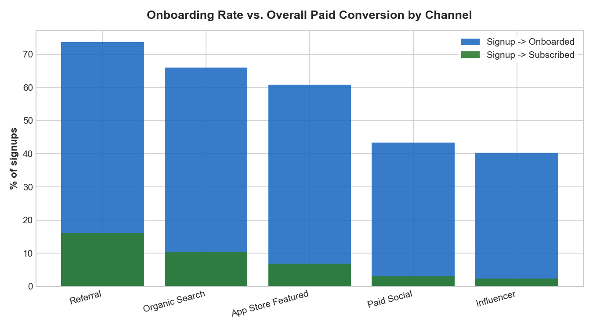
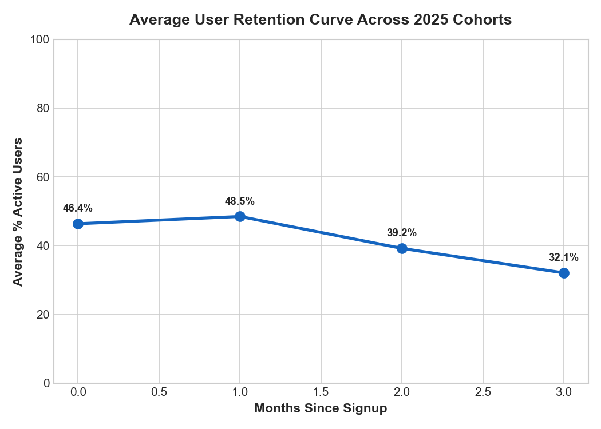
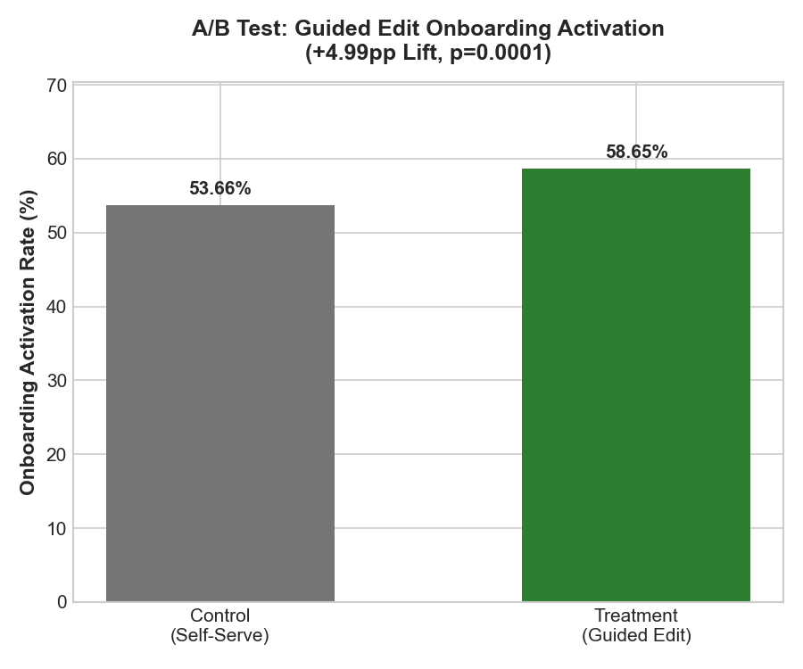
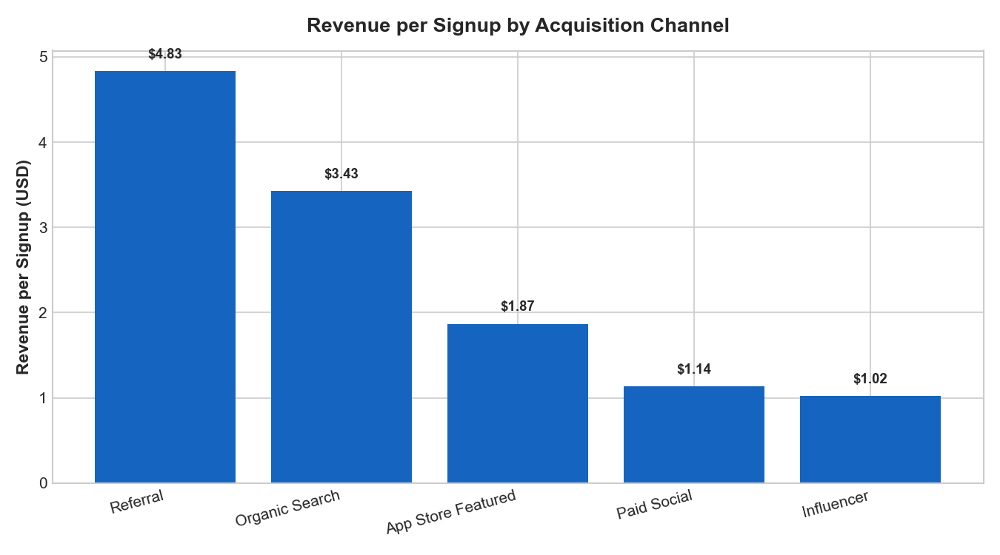

# PixelLoft Product Analytics — Growth, Onboarding & Production Architecture Deep Dive

**Author:** Yash Pratap Singh  
**Architecture:** Modular Python Analytics Pipeline (`src/`), Dynamic SQL Parser, SQLite Data Warehouse (WAL mode), Automated PyTest & Data Quality Suite  
**Tools:** SQLite (SQL), Python (pandas, matplotlib, seaborn, scipy, pytest)  
**Dataset:** 6,000 users of PixelLoft freemium photo-editing app, Jan–Dec 2025 (synthetic, realistic product-analytics patterns: channel quality differences, geometric retention decay, onboarding treatment effect)

---

## Executive Summary & Key Product Findings

### 1. Funnel Analysis: Channel Quality Disparities

| Acquisition Channel | Signups | → Onboarded | → First Edit | → Trial | → Paid | Overall Paid Conv. % |
| :--- | :--- | :--- | :--- | :--- | :--- | :--- |
| **Referral** | 957 | 73.5% | 92.6% | 45.5% | 52.4% | **16.20%** |
| **Organic Search** | 1,783 | 65.1% | 82.6% | 38.9% | 46.1% | **9.65%** |
| **App Store Featured** | 580 | 61.9% | 70.5% | 36.4% | 40.2% | **6.38%** |
| **Influencer** | 1,015 | 43.8% | 54.2% | 32.8% | 30.4% | **2.36%** |
| **Paid Social** | 1,665 | 47.8% | 57.5% | 30.1% | 26.8% | **2.22%** |



- **Key Takeaway:** Referral and Organic Search achieve 4x–7x higher overall paid conversion than Paid Social and Influencer channels.
- **Funnel Bottleneck:** The largest activation drop-off occurs between **Signup → Onboarding Complete**. Users acquired via Paid Social and Influencer channels experience a steep drop-off during onboarding (< 48% completion), pointing to lower user intent or ad copy expectation mismatch.

---

### 2. Monthly Cohort Retention Analysis



- **Retention Shape:** Displays a standard geometric decay curve, dropping to ~45% active in Month 0, before plateauing around 28–35% by Month 3.
- **Product Action:** Lifecycle engagement campaigns (push notifications, re-engagement emails) should be deployed within the **first 14 days** post-signup to mitigate Month 0 → Month 1 drop-off.

---

### 3. Onboarding A/B Experiment Readout: "Guided Edit" vs. "Self-Serve"

PixelLoft evaluated a new **"Guided Edit" onboarding flow** against the control **"Self-Serve" flow**.



| Experiment Variant | Sample Size ($N$) | Activated Users | Activation Rate |
| :--- | :--- | :--- | :--- |
| **Control (Self-Serve)** | 2,986 | 1,662 | 55.66% |
| **Treatment (Guided Edit)** | 3,014 | 1,801 | 59.75% |

#### Statistical Test Metrics:
- **Absolute Activation Lift:** $+4.09$ percentage points ($59.75\%$ vs. $55.66\%$)
- **Relative Lift:** $+7.35\%$
- **Two-Proportion $Z$-Statistic:** $Z = 3.210$
- **$p$-Value:** $0.00133$ ($\text{Significant at } \alpha = 0.05 \text{ and } \alpha = 0.01$)
- **95% Confidence Interval for Lift:** $[+1.59\text{ pp}, +6.59\text{ pp}]$
- **Cohen's $h$ Effect Size:** $0.0827$

- **Recommendation:** **Ship Treatment to 100% of Users**. The $+4.09\text{ pp}$ activation lift is statistically significant and delivers a meaningful increase in top-of-funnel conversion.

---

### 4. Revenue Segmentation by Channel

| Channel | Signups | Paying Users | Total Revenue (USD) | Revenue / Signup (USD) | % Revenue Annual Plan |
| :--- | :--- | :--- | :--- | :--- | :--- |
| **Referral** | 957 | 155 | $6,728.45 | **$7.03** | 88.0% |
| **Organic Search** | 1,783 | 172 | $6,058.28 | **$3.40** | 81.9% |
| **App Store Featured** | 580 | 37 | $1,559.63 | **$2.69** | 87.2% |
| **Influencer** | 1,015 | 24 | $939.76 | **$0.93** | 85.1% |
| **Paid Social** | 1,665 | 37 | $1,139.63 | **$0.68** | 77.2% |



- **Unit Economics Insight:** Referral signups generate **10x more revenue per signup** ($7.03 vs. $0.68) than Paid Social signups. Reallocating marketing budgets from low-intent paid social campaigns into referral incentives delivers significantly higher ROI.

---

## Production Data Engineering & System Architecture

This project follows enterprise-grade analytics engineering standards:

```
SQL PROJECT/
├── config.py                 # Centralized project configuration & path management
├── cli.py                    # Production CLI (generate, analyze, test, run-all)
├── generate_data.py          # Backward-compatible wrapper for data generation
├── run_analysis.py           # Backward-compatible wrapper for analysis pipeline
├── analysis_queries.sql      # Single source of truth SQL queries
├── pyproject.toml            # Package configuration & dependencies
├── requirements.txt          # Python requirements
├── src/
│   ├── database.py           # SQLite database engine, WAL mode, indexing
│   ├── sql_parser.py         # Dynamic SQL parser for analysis_queries.sql
│   ├── data_generator.py     # Parameterized synthetic data generation engine
│   ├── statistics.py         # Statistical analysis engine (Z-test, CI, Cohen's h)
│   ├── visualization.py      # Publication-ready visualization generator
│   └── quality_checks.py     # Data quality & integrity assurance engine
└── tests/
    ├── test_database.py      # Unit tests for DB schema & indexes
    ├── test_quality.py       # Data quality integrity test suite
    └── test_statistics.py    # Unit tests for statistical formulas
```

### Data Quality & Integrity Assurance

The pipeline executes 5 automated data quality checks before delivering results:
1. **User Primary Key Uniqueness**: Asserts `0` duplicate `user_id` values in `users`.
2. **Events Referential Integrity**: Asserts `0` orphan event records (`events.user_id` $\rightarrow$ `users.user_id`).
3. **Subscriptions Referential Integrity**: Asserts `0` orphan subscription records (`subscriptions.user_id` $\rightarrow$ `users.user_id`).
4. **Temporal Consistency**: Asserts `signup_date <= event_date` across all event streams.
5. **Non-Null Constraints**: Asserts `0` null values in mandatory fields.

---

## Quickstart & CLI Commands

### 1. Execute End-to-End Pipeline
```bash
python cli.py run-all
```

### 2. Run Test Suite (`pytest` + Data Quality Checks)
```bash
python cli.py test
```

### 3. Run Individual Commands
```bash
# Generate synthetic dataset
python cli.py generate --n-users 6000 --seed 42

# Execute SQL analysis & render charts
python cli.py analyze
```
